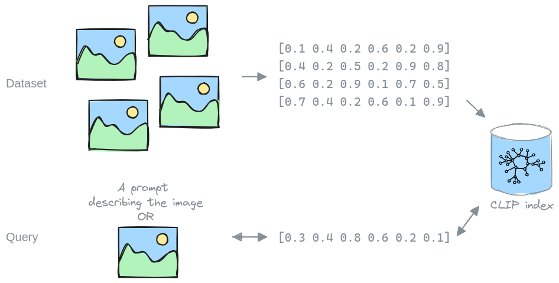

# Building a Datacomp CLIP index with Fondant

<p align="center">
    <a href="https://github.com/ml6team/fondant">
        
    </a>
</p>

<p align="center">
    <i>
        <b>Production-ready</b> 
        data processing made 
        <b>easy</b> 
        and 
        <b>shareable</b>
    </i>
    <br>
    <a href="http://fondant.ai"><strong>Explore the Fondant docs »</strong></a>
    <br>
    <br>
    <a href="https://discord.gg/HnTdWhydGp"></a>
    <a href="https://fondant.readthedocs.io/en/latest/license/"></a>
</p>

## Introduction

This repository contains the code to build a CLIP index for the Datacomp-12.8M dataset with 
Fondant. It should be straightforward to apply it to a different dataset.

The resulting embedded dataset and index have been published on the Hugging Face Hub 
[here](https://huggingface.co/datasets/fondant-ai/datacomp-small-clip). The data repository is 
structured as follows:
- [data/](https://huggingface.co/datasets/fondant-ai/datacomp-small-clip/viewer/embeddings): The 
  dataset containing ids, urls, and CLIP embeddings
- [faiss](https://huggingface.co/datasets/fondant-ai/datacomp-small-clip/blob/main/faiss): 
  The faiss index
- [id_mapping/](https://huggingface.co/datasets/fondant-ai/datacomp-small-clip/viewer/id_mapping): 
  The mapping of the faiss ids to the original urls

Continue reading below to learn:
- [Why we need a CLIP index](#why-a-clip-index)
- [How to use the CLIP index](#using-the-index)
- [Which steps are needed to create the index](#creating-the-index)
- [The execution details of our run](#execution-details)
- [What's next](#whats-next)

## Why a CLIP index?

Large (image) datasets are often unwieldy to use due to their sheer size. Assume for instance
that we would like to extract all the cat images from such a dataset. We would have to look at
every image to classify if it's a cat image or not. And if we want to extract all the dog images
next, we again need to look at every image.

Instead, we can look at every image once, and calculate a (CLIP) embedding representing its
content. Combining these embeddings into an index, we can efficiently search through the dataset
with a query, finding specific images, without having to look at each one.




This is what LAION did for their [LAION-5b dataset](https://laion.ai/blog/laion-5b/), which made 
it possible to use, like we did in our 
[ControlNet example](https://github.com/ml6team/fondant-usecase-controlnet). 
Unfortunately, the LAION-5b dataset and index have been 
[taken offline](https://laion.ai/notes/laion-maintanence/) (temporarily) and there 
[aren't any alternatives](https://github.com/rom1504/clip-retrieval/issues/324). This is
why we built an index for the Datacomp-12M dataset. While it is a lot smaller than LAION-5b, it
should already enable a lot of use cases again, and can hopefully be the start towards building
indices for more and larger datasets.

## Creating the index

We leveraged Fondant to generate the CLIP index and published the pipeline in this git 
repository. You can find it in [`pipeline.py`](pipeline.py).
The pipeline consists of 4 steps:

- A [`load_from_hf_hub`](https://fondant.ai/en/stable/components/hub/#load_from_hf_hub#description) 
  operation that loads the 
  [datacomp_small](https://huggingface.co/datasets/mlfoundations/datacomp_small) dataset from 
  huggingface into the Fondant workspace and format.
- A [`download_images`](https://fondant.ai/en/stable/components/hub/#download_images#description)
  operation which downloads the actual images from the urls in the dataset.
- A [`embed_images`](https://fondant.ai/en/stable/components/hub/#embed_images#description) operation which embeds the downloaded images using a CLIP model.
- A [`write_to_file`](https://fondant.ai/en/stable/components/hub/#write_to_file#description) 
  operation which writes the original urls and generated embeddings to the chosen destination.

You can run it by installing fondant:
```shell
pip install fondant==0.11.0
```
and running it with your runner of choice:
```shell
fondant run <runner> pipeline.py
```

Check the [fondant documentation](https://fondant.ai/en/latest/runners/local/) for more info.

After running the pipeline, we used [`autofaiss`](https://github.com/criteo/autofaiss) to build the 
CLIP index. You can use the included wrapper script [`build_index.py`](build_index.py).

Once you have created the index, you can explore your index and validate that everything is 
working using the [`exploration.ipynb`](exploration.ipynb) notebook.

## Using the index

### With Fondant

The easiest way to use the index, is using Fondant. Fondant offers reusable operations which
allow you to query the index with your data:
- [By prompt](https://fondant.ai/en/latest/components/hub/#retrieve_from_faiss_by_prompt#description)
- [By embedding](https://fondant.ai/en/latest/components/hub/#retrieve_from_faiss_by_embedding#description)

To see how it can be used in an end-to-end example, check our 
[ControlNet example](https://github.com/ml6team/fondant-usecase-controlnet) which
uses the index to create a dataset to fine-tune a ControlNet model on a specific domain.

### With Clip-Retrieval

There are other open source tools which allow you to leverage a CLIP index. We can recommend
[clip-retrieval](https://github.com/rom1504/clip-retrieval) which lets you set up a service 
hosting the index accessible by API.

## Execution details

For the execution details of our 12.8M run, check the 
[announcement](https://fondant.ai/en/stable/blog/2024/03/05/building-a-datacomp-clip-index-with-fondant/).

## What's next

### Making data building collaborative

With Fondant we aim to make data building collaborative, and we will share more features built 
on top of the Datacomp datasets to showcase this in the future. To stay up to date, join our
[Discord](https://discord.gg/HnTdWhydGp).

### Larger datasets

Based on the popularity and feedback we receive on this 12.8M index, we might generate a CLIP
index for the datacomp-128M dataset. If there are other datasets you are interested in, or want 
to generate an index for a different dataset yourself, please let us know in our 
[Discord](https://discord.gg/HnTdWhydGp).
